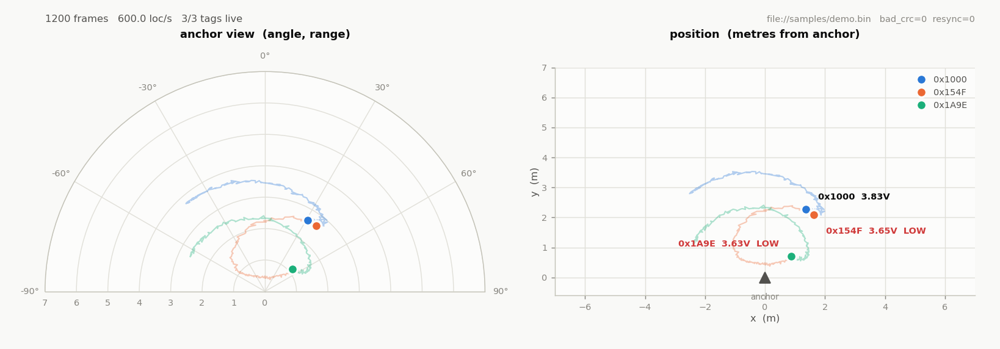

# pyassistant — MaUWB AOA 오픈소스 상위기

`MaUWB_Assistant(v3.66).exe` 를 대체하는 Python 도구입니다.
원본은 久凌电子(Jiuling Electronics)의 **비공개 상용 Qt 프로그램**이라 소스가 공개돼
있지 않지만, 장비가 쓰는 시리얼 프로토콜은 패키지에 동봉된 규격서에 전부 문서화돼
있습니다. 이 패키지는 그 규격서만 보고 처음부터 새로 구현한 것입니다.

원본과 달리 **Windows 32비트 전용이 아니고**, 소스가 열려 있어 수정·확장이 가능합니다.



---

## 무엇이 들어 있나

| 경로 | 설명 |
|---|---|
| `mauwb/protocol.py` | 프레임 정의·파싱·생성, XOR 체크섬, `tag_detail_para` 비트필드 |
| `mauwb/stream.py` | UART 스트림에서 프레임 추출 (자동 리싱크) |
| `mauwb/transport.py` | 시리얼 / TCP / 파일 리플레이 |
| `mauwb/commands.py` | 기지국·태그·정비(整机) 설정 명령 빌더 |
| `mauwb/logging_.py` | CSV·원시 바이트 로거 |
| `mauwb/theme.py` | 차트 색상 토큰 |
| `mauwb_cli.py` | 콘솔 도구 (sniff / send / replay / decode / ports) |
| `mauwb_viewer.py` | 실시간 위치 뷰어 |
| `tools/make_sample.py` | 하드웨어 없이 테스트할 합성 캡처 생성기 |
| `tests/test_protocol.py` | 규격서 예제 프레임 기준 단위 테스트 |

---

## 설치

```bash
cd pyassistant
pip install -r requirements.txt
```

Python 3.8 이상이면 됩니다. 외부 의존성은 `pyserial` 과 `matplotlib` 둘뿐이고,
둘 다 선택 사항입니다 (파일 리플레이만 쓰면 표준 라이브러리만으로 동작).

---

## 빠른 시작

### 하드웨어 없이 먼저 돌려보기

```bash
python tools/make_sample.py samples/demo.bin --tags 3 --seconds 20
python mauwb_cli.py replay samples/demo.bin --quiet --stats
python mauwb_viewer.py file://samples/demo.bin --range 7 --loop
```

### 실제 장비에 연결

```bash
python mauwb_cli.py ports                    # 포트 확인
python mauwb_cli.py sniff COM7               # 디코딩된 프레임 실시간 출력
python mauwb_viewer.py COM7 --range 10       # 실시간 뷰어
```

Linux/macOS 는 `COM7` 대신 `/dev/ttyUSB0`, `/dev/tty.usbserial-XXXX` 등을 씁니다.

---

## ⚠️ 먼저 확인할 것: 상위기 보고 형식

기지국의 `setcfg` 7번째 인자가 **상위기 보고 형식(上报格式)** 입니다.

| 값 | 형식 |
|---|---|
| **0** | **통용(通用) — 이 패키지가 파싱하는 바이너리 프로토콜** |
| 1 | JSON |
| 2 | 소형차 추종 형식 |
| 3 | 소형차 측위 형식 |

**반드시 0 이어야 합니다.** 프레임이 하나도 안 잡히면 십중팔구 이 값이 0이 아닙니다.

```bash
python mauwb_cli.py send COM7 anchor getcfg              # 현재 설정 확인
python mauwb_cli.py send COM7 anchor setcfg 1 1 1111 1 100 1 0
python mauwb_cli.py send COM7 anchor saver               # 저장 후 재부팅
```

---

## 프로토콜 요약

출처: 「久凌 AOA 通信协议」(久凌(温州)电子科技有限公司, 2025-03-24).
`MaUWB_AOA_Assistant.zip` 안의 `d3b51756734822.pdf` 입니다.

모든 다중 바이트 필드는 **리틀엔디언**(低位在前)입니다.

### 공통 프레임 구조

```
오프셋  크기  필드
0       1    head        0x2A 고정
1       2    cmd_len     bytes[3 : 3+cmd_len] 의 길이
3       8    cmd_saddr   자기 long address
11      8    cmd_daddr   상대 long address
19      1    cmd_type
20      1    cmd_direct
21      *    payload
*       1    check       bytes[3 : 3+cmd_len] 의 XOR
*       1    foot        0x23 고정
```

전체 프레임 길이 = `cmd_len + 5`.

### cmd_type

| 값 | 의미 | 전체 길이 |
|---|---|---|
| 0x01 | 基站定位帧 — 측위 보고 | 81 |
| 0x02 | 基站配置帧 — 기지국 설정 | 가변 |
| 0x03 | 标签配置帧 — 태그 설정 | 가변 |
| 0x04 | OTA 升级帧 | 가변 |
| 0x05 | 整机配置帧 — 정비 설정 | 가변 |
| 0x64 | 基站定位帧 RSSI | 89 |

### cmd_direct

`1` 引擎请求 · `2` 设备回复 · `3` 设备请求 · `4` 引擎回复 · `5` 引擎上报 · `6` 设备上报
(여기서 "引擎(엔진)"이 PC 쪽입니다.)

### 측위 프레임 본문 (0x01)

| 오프셋 | 타입 | 필드 |
|---|---|---|
| 21 | uint32 | `tag_time` 태그 통신 시각 |
| 25 | uint16 | `anc_addr16` 기지국 단주소 |
| 27 | uint16 | `tag_addr16` 태그 단주소 |
| 29 | uint8 | `tag_sn` 통신 시퀀스 번호 |
| 30 | uint8 | `tag_mask` 통신 유효 |
| 31 | int16 / uint16 | 기지국 0 필터 각도(°) / 거리(cm) |
| 35 / 39 / 43 | int16 / uint16 | 기지국 1 / 2 / 3 각도·거리 |
| 47 | uint32 | `tag_detail_para` 비트필드 (아래) |
| 51 | uint16 ×3 | 가속도 x/y/z |
| 57 | uint16 ×3 | 자이로 x/y/z |
| 63 | int16 | `self_raw_angle` 미필터 각도 |
| 65 | uint16 | `self_raw_range` 미필터 거리(cm) |
| 67 | int32 | `self_raw_degree` 원시 각도 (기지국 교정용) |
| 71 | uint16 | `angle_360` 360° 각도 (정비 연동) |
| 73 | uint8 | `angle_dir` 대략 방향 |
| 74 | uint8×5 | 예약 |

**0x64(RSSI) 프레임은** 각 기지국의 거리 뒤에 `int16` RSSI 가 하나씩 끼어들어,
오프셋 31 이후가 8바이트씩 밀립니다. 그래서 전체 길이가 89바이트입니다.

### `tag_detail_para` 비트필드 (LSB부터)

| 비트 | 필드 |
|---|---|
| 0 | `is_lowbattery` 저전압 경보 |
| 1 | `is_alarm` 경보 |
| 2 | `is_chrg` 충전 중 |
| 3 | `is_tdby` 충전 완료 |
| 4–13 | `battery_val` 전지 전압 (350 = 3.50 V) |
| 14 | `is_offset_range_zero_bit` 거리 교정 |
| 15 | `is_offset_pdoa_zero_bit` 각도 교정 |
| 16–19 | `turn_up` / `turn_down` / `turn_left` / `turn_right` (리모컨 전용) |
| 20–22 | `mode` (리모컨 전용) |
| 23 | `recal` 호출 (리모컨 전용) |
| 24 | `lock` 잠금 (리모컨 전용) |
| 25–27 | `dev_type` 0 학습보드 / 1 손목밴드 / 2 리모컨 |
| 28–31 | 예약 |

### 체크섬

```c
static uint8_t get_Xor_CRC(uint8_t *bytes, int offset, int len) {
    uint8_t xor_crc = 0;
    for (int i = 0; i < len; i++) xor_crc ^= bytes[offset + i];
    return xor_crc;
}
```

`check = get_Xor_CRC(frame, 3, cmd_len)`.

---

## CLI 사용법

### `sniff` — 실시간 디코딩

```bash
python mauwb_cli.py sniff COM7
python mauwb_cli.py sniff COM7 -b 921600 --csv run.csv --raw run.bin --stats
python mauwb_cli.py sniff COM7 --tag 0x64D8 --hex      # 특정 태그만, 바이트까지
python mauwb_cli.py sniff tcp://192.168.1.50:8888      # 시리얼-이더넷 브리지
```

`--raw` 로 남긴 파일은 나중에 `file://` 로 그대로 재생됩니다.

### `send` — 설정 명령

```bash
python mauwb_cli.py send COM7 anchor getcfg
python mauwb_cli.py send COM7 anchor addtag 10205FA01000154F 154F 0001 000A 00
python mauwb_cli.py send COM7 anchor getklist          # 바인딩된 태그 목록
python mauwb_cli.py send COM7 tag gettag
python mauwb_cli.py send COM7 robot em_smode 1         # 추종 모드
python mauwb_cli.py send COM7 anchor reset --dry-run   # 보내지 않고 프레임만 확인
```

### `replay` / `decode`

```bash
python mauwb_cli.py replay run.bin --stats --csv out.csv
python mauwb_cli.py decode 2A 4C 00 DD DD ... 3D 23
```

---

## 뷰어 사용법

```bash
python mauwb_viewer.py COM7 --range 10 --fov 90 --trail 200
python mauwb_viewer.py file://samples/demo.bin --speed 4 --loop
python mauwb_viewer.py COM7 --tag 0x154F --csv live.csv
```

| 옵션 | 설명 |
|---|---|
| `--range` | 플롯 반경 (m) |
| `--fov` | 폴라 반각 (°) |
| `--trail` | 궤적 길이 (샘플 수) |
| `--timeout` | 이 시간 동안 갱신 없으면 태그를 흐리게 (초) |
| `--speed` / `--loop` | `file://` 재생 속도 / 반복 |

왼쪽은 기지국이 실제로 측정하는 값(각도·거리) 그대로의 폴라 뷰,
오른쪽은 같은 데이터를 기지국 기준 직교좌표(m)로 옮긴 것입니다.
기지국 정면이 **+Y**, 양의 각도가 **오른쪽(+X)** 입니다.

---

## 라이브러리로 쓰기

```python
from mauwb.stream import FrameStream
from mauwb.transport import open_transport
from mauwb.protocol import LocFrame

stream = FrameStream()
with open_transport("COM7", baudrate=115200) as port:
    while True:
        for f in stream.feed(port.read(4096)):
            if isinstance(f, LocFrame):
                a = f.primary()
                if a:
                    x, y = a.xy()
                    print(f"tag 0x{f.tag_addr16:04X}  {x:+.2f} {y:+.2f} m  "
                          f"{f.detail.battery_v:.2f}V")
```

설정 명령도 마찬가지입니다.

```python
from mauwb.commands import Anchor

anchor = Anchor()
port.write(anchor.setcfg(discover_tags=1, bind_tags=1, pan_id=0x1111,
                         anchor_id=1, report_format=0))
port.write(anchor.saver())
```

---

## 테스트

```bash
python -m unittest discover -s tests -v
```

30개 테스트가 규격서의 예제 프레임(`[备注 6]`)을 기준으로 필드 오프셋·엔디언·
체크섬·비트필드를 검증하고, 스트림 파서가 모든 바이트 경계에서 분할되거나
쓰레기 바이트·가짜 헤더가 섞여도 프레임을 잃지 않는지 확인합니다.

---

## 문제 해결

| 증상 | 원인 |
|---|---|
| 프레임이 하나도 안 잡힘 | `setcfg` 의 상위기 보고 형식이 0 이 아님 (위 참고) |
| `bad_crc` 가 계속 올라감 | 보드레이트 불일치. 115200 과 921600 을 바꿔가며 시도 |
| `resyncs` 만 올라가고 프레임 0 | 다른 프로토콜이거나 TX/RX 반전 |
| 포트 열기 실패 (Windows) | 원본 Assistant 나 다른 터미널이 포트를 잡고 있음 |
| 포트 권한 거부 (Linux) | `sudo usermod -aG dialout $USER` 후 재로그인 |
| 태그는 보이는데 거리가 0 | 기지국에 태그가 바인딩되지 않음 — `getklist` / `addtag` 확인 |

---

## 원본 프로그램에 대해

`MaUWB_AOA_Assistant.zip` 은 소스가 아니라 **컴파일된 Windows 배포판**입니다.

- 제작사: 久凌(温州)电子科技有限公司 — `www.jiulingdianzi.com`
  (Makerfabs 는 이 모듈을 OEM 으로 재판매)
- 빌드: MinGW-W64 GCC 7.3.0 (i686), Qt 5.x 32비트
- 사용 모듈: Qt5 Core / Gui / Widgets / SerialPort / Network / Sql / Xml /
  PrintSupport / DataVisualization
- 릴리스 빌드로 스트립돼 있어 소스 경로·클래스명이 남아있지 않음

Qt 프로젝트 파일(`.pro` / `.cpp` / `.ui`)은 어디에도 공개돼 있지 않습니다.
그래서 이 패키지는 역공학이 아니라, 공개된 프로토콜 규격서만 보고 새로 작성했습니다.

## 라이선스

이 디렉터리의 코드는 자유롭게 쓰시면 됩니다.
프로토콜 규격서 자체의 저작권은 久凌电子에 있습니다.
